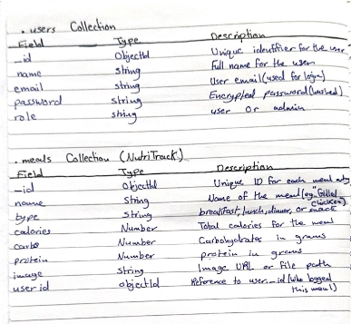
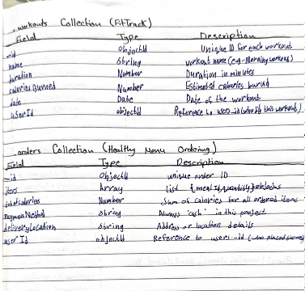
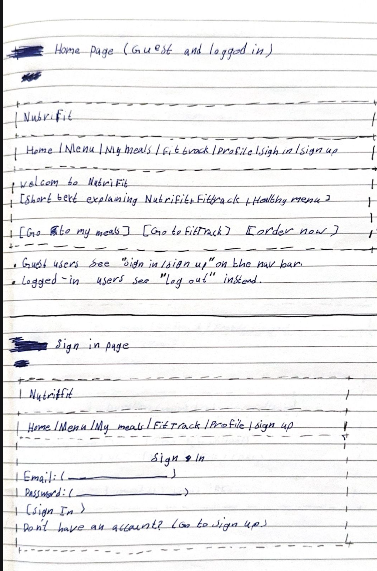
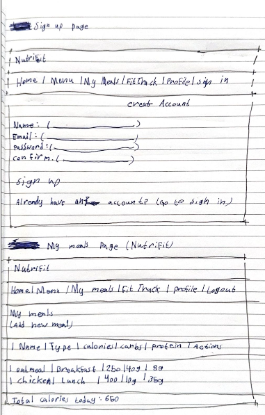
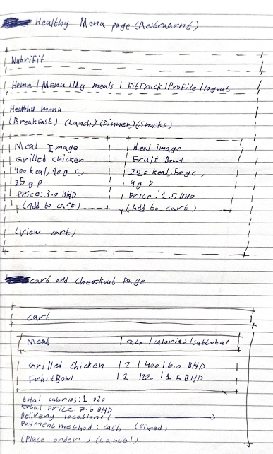
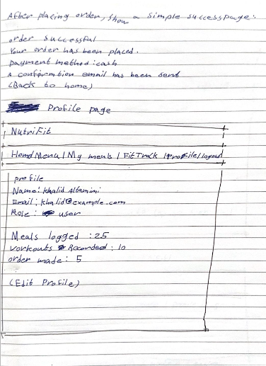

# NutriFit-Application-Project

Authentication:
As a user, I want to sign up with my name, email, and password so that I can create a personal account.
As a user, I want to log in and log out so that my data stays secure.
As a user, I want to stay logged in during my session so that I don’t need to log in again on every page.

NutriTrack (Meal Tracking):
As a user, I want to add a meal with name, type (breakfast/lunch/dinner/snack), calories, carbs, and protein so that I can track my daily nutrition.
As a user, I want to view all my meals so that I can review what I ate.
As a user, I want to update a meal so that I can correct mistakes.
As a user, I want to delete a meal so that I can remove incorrect entries.
As a user, I want to see only my own meals so that my data stays private.

FitTrack (Workout Tracking):
As a user, I want to add a workout with name/type, duration, and calories burned so that I can track my fitness activity.
As a user, I want to view my workouts so that I can monitor my progress.
As a user, I want to edit a workout so that I can fix mistakes.
As a user, I want to delete a workout so that I can remove unwanted records.
As a user, I want to see only my own workouts so that my progress remains private.

Healthy Menu (Restaurant Menu):
As a user, I want to browse menu categories (breakfast, lunch, dinner, snacks) so that I can find meals easily.
As a user, I want to see each menu item with an image and nutrition info (calories, carbs, protein) so that I can choose healthy options.
As a user, I want to add menu items to a cart so that I can place an order.
As a user, I want to change item quantities in the cart so that I can order the correct amount.
As a user, I want to remove items from the cart so that I can update my order before checkout.

My App Link:http://localhost:3000/menu

NutriFit is a web-based health management application that combines meal tracking, fitness activity tracking, and a healthy restaurant menu into one system. The platform allows users to securely create accounts, log daily meals and nutritional values, track workouts, and browse categorized healthy meals with detailed information. Users can also place food orders using cash payment and receive confirmation notifications. By integrating these features in a simple and user-friendly interface, NutriFit helps users manage their nutrition and fitness goals effectively, making it suitable as a practical and professional graduation project.

Attributions:
https://encrypted-tbn0.gstatic.com/images?q=tbn:ANd9GcQ5WCKvoTb8TJqfz_nSF7lfxH5XYDBxJh4COw&s

https://media.istockphoto.com/id/1592210966/photo/happy-black-man-running-in-park-with-music-smile-and-mockup-in-nature-garden-and-workout.jpg?s=612x612&w=0&k=20&c=pkxEU_3g0-ClVb95hCZYxeVK5QrWFoY5J4uoES9seM8=

https://www.pexels.com/search/sandwiches/

Technologies Used: -CSS -Javascript -Html

Next steps: 
-I would like to add a page for the favorites, so the user can add his favorite meal.
-I will include a Fat in all meals so it will be (Calories - Carbs - Protein - Fat).
-I would do a page for the user goals, So he can type his goals with the date of typing this goal, And try to achieve it, and when he does the user will put a tick on his goal.